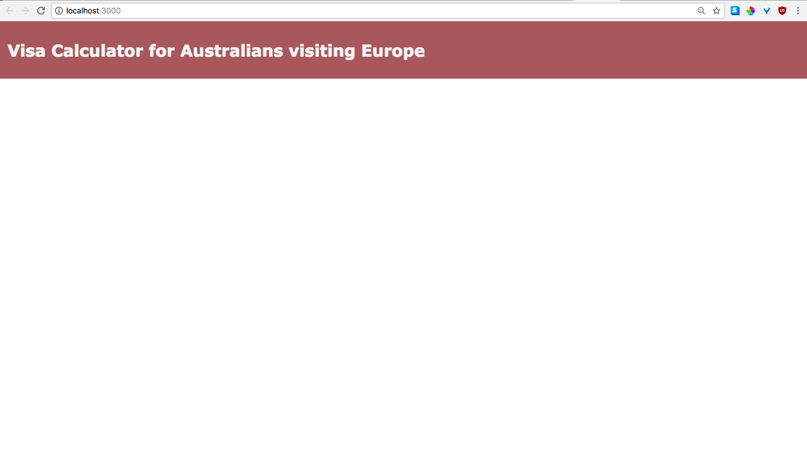

# Australian-Europe Visa Calculator
This project was bootstrapped with [Create React App](https://github.com/facebookincubator/create-react-app).

This application is intended for Australians visiting Europe, who want to check that their travel or planned travel meets immigration requirements, or to determine how many more days they are able to travel within European countries.


### Running the application
If you don't already have NodeJS installed, you can download and install it following the instructions [here](https://nodejs.org/en/download/).

Then, clone this repository and navigate to its directory. Run the following commands to install its dependencies (the extra code it needs to run), and start the application:

```
npm install
```

```
npm start
```

Your browser should open a new window with the application. If it doesn't, try entering `localhost:3000` into your URL bar.

### Testing
This application was developed using Chrome 63.0.3239.132 running on macOS High Sierra 10.13.2.

It has not been tested on other browsers or operating systems. Your milage may vary.

### Screenshot of current application

