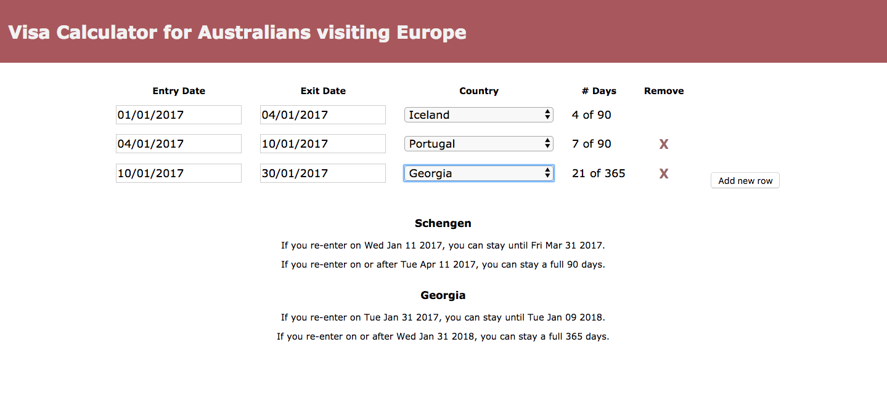

# Australian-Europe Visa Calculator

## Introduction
This application is intended for Australians visiting Europe, who want to check that their travel or planned travel meets immigration requirements, or to determine how many more days they are able to travel within European countries.



The rules for Schengen entry sounds deceptively simple - no more than 90 days in Schengen in any 180 day period. But when entering and exiting Schengen on a frequent basis, it can be difficult to plan how long it's possible to stay. This calculator was created after several discussions (debates) involving back-of-the-envelope calculations of when one can next enter Schengen and for how long. The calculator was then extrapolated to include more European countries.

The list of European countries was obtained from Simple English Wikipedia [here](https://simple.wikipedia.org/wiki/List_of_European_countries).

The application currently only includes countries that don't require an entry visa for Australians visiting for tourism purposes.

## Environments
`visa-calculator` was developed on `Mac OS High Sierra 10.13.2` using `Node.js v8.9.4 LTS`, but should work on any environments that support [Node.js](https://nodejs.org).

## Installation
If you don't already have NodeJS installed, you can download and install it following the instructions [here](https://nodejs.org/en/download/).

Then, clone this repository and navigate to its directory.
```
$ git clone https://github.com/georgiah/visa-calculator
$ cd visa-calculator
```

You must install `visa-calculator`'s dependencies before running for the first time:
```
$ npm install
```

## Usage
To start a development server, run the following:
```
$ npm start
```

Your browser should open a new window with the application. If it doesn't, try entering `localhost:3000` into your URL bar.

Here's a demonstration of the calculator you should see:


## Discussion
The most tricky aspect of this project was determining how to both:
- maintain a list of visits in the order in which the user entered them, to display in the table of inputs
- maintain a list of visits in ascending order for each visa zone, to calculate any overlaps in visits (eg. exiting Iceland on 04/01 and entering Portugal on 04/01 should count as just one day, not two)

This was achieved by maintaining the first list in the state of `App`, and doing some manipulation on that list in `TravelAdvice` to create the second list. This means that the manipulation must be done for the entire list every time the state is updated, which isn't ideal - but given that the expected maximum length of the list is <100, this isn't a significant amount of work.

Areas that could be extended upon include:
- visually highlight any input rows where the stay is longer than the maximum permitted
- include countries that require a visa for entry
- include an input option for travellers holding a visa
